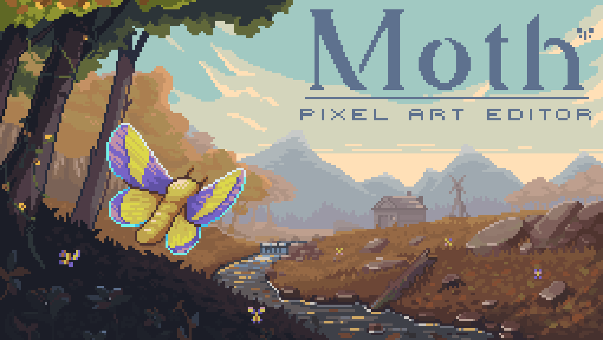
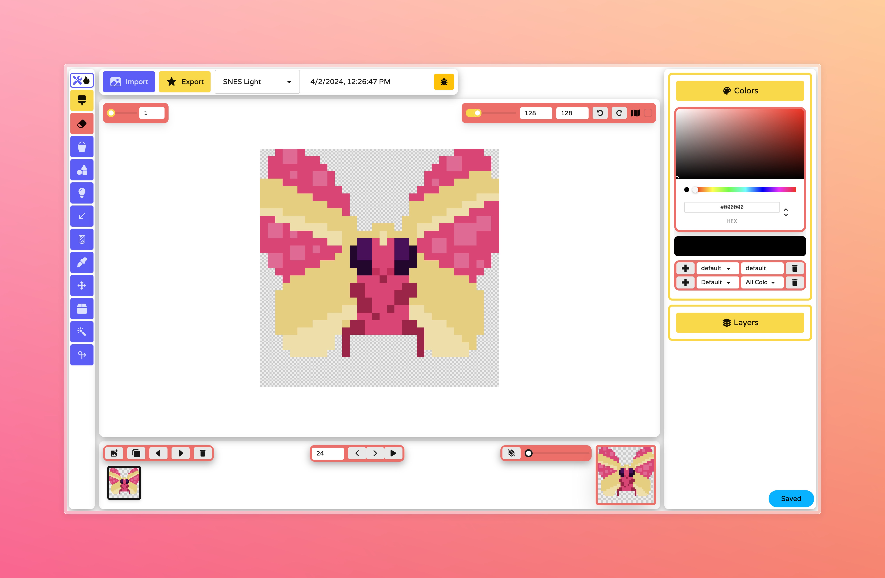

# Moth: <a href="https://foobar404.dev/moth/" target="_blank">Pixel Art editor</a>

The Moth pixel art editor is the first of many free web apps geared towards indie game developers.
With a focus on packing powerful features into a simple to use interface, Moth is meant to be a pixel art editor
with an easy learning curve. 

## TODO
- (Easy)(Feature) add talorence to wand 
- (Easy)(Feature) rainbow color mode
- (Easy)(Feature) random color mode
- (Easy)(Bug) light and color picker doesint add color if missing
- (Easy)(Feature) npm i react-beautiful-dnd
    - (Easy)(Feature) dnd tabs
- (Easy)(Bug) obfuscate build code
- (Easy)(Feature) export format dropdown
- (Easy)(Bug) thickness for shapes
- (Easy)(Feature) flatten all layers
- (Easy)(Feature) play animation backwards?
- (Easy)(Feature) ping / pong animation loop?
- (Easy)(Feature) export as zip, file for each frame
- (Easy)(Feature) move tool is like a selection tool
- (Easy)(Feature) indexed colors
- (Easy)(Feature) animate main canvas
- (Easy)(Feature) Use the same icons set across the app
- (Easy)(Feature) Join multiple similer tool into one iterface
- (Medium)(Feature) copy / paste selection
- (Medium)(Feature) mirror mode
    - (Easy)(Feature) mirror from starting point
    - (Easy)(Feature) mirror ying / yang
- (Medium)(Feature) add drag handles to resize the canvas
    - (Hard)(Bug) pixels get deleted when changing the canvas size
    - (Medium)(Feature) add current mouse position & canvas size at bottom left
- (Medium)(Feature) scroll zooms to the mouse position
- (Medium)(Feature) left click in canvas area for center/tool/clear wheel, right click to pan
    - (Easy)(Feature) make clear more accessable
- (Medium)(Bug) make local projects use indexDB instead
- (Medium)(Bug) make light tool use lines
- (Medium)(Bug) make sure all brush combinations work with left and right buttons
- (Medium)(Feature) export as css
- (Medium)(Feature) onion skinning for furure frame
    - onion skinning color effects
- (Medium)(Feature) import gif as frames
- (Medium)(Feature) fullscreen canvas mode
- (Medium)(Feature) Sprite packing
- (Medium)(Feature) Import and slice existing .png spritesheets.
- (Medium)(Feature) .pyxel and .asesprite / .ase import
- (Medium)(Feature) load demo button
- (Medium)(Feature) wrap around move option
- (Medium)(Feature) allow creating multiple animations
- (Medium)(Feature) add console error watch system
- (Medium)(Feature) Multiple sprite tabs
- (Hard)(Feature) tools only modify active selection
- (Hard)(Feature) better selection box
- (Hard)(Feature) download as svg
- (Hard)(Feature) export as .tmx
- (Hard)(Feature) make selections standout
    - rotate
    - scale
    - draw only in selection
    - move to new layer / frame
- (Hard)(Feature) Ctrl-z undos brush strokes and last canvas resize
    - CTRL-Z undos and changes in text (title, color palette name, ect)
    - When you undo layer joins, the number of layers does not change, the layer just disappears.
    - Undo redo wont work with layers
- (Hard)(Bug) get color picker working again
    - Color pallets that are premade
    - Option to create a color pallet from sprite
    - color pallette recommendations 
    - recommend colors based on current pallete and AI 
    - recommend better color alternatives based on AI 
    - pallette 
        - when changing color in pallete, update all instances of that color in all layers 
        - import/paste and export/copy a color pallette 
        - import pallette from image 
            - limit pallette to x colors
            - start with most common colors
            - squash similer colors?
    - deleting a color from the pallette doesint effect layers
    - lights / darks 
    - add opacity 
- (Hard)(Feature) Add smudge tool
- (Hard)(Feature) add font tool
- (Hard)(Feature) settings modal
    - (Easy)(Feature) update shortcut keys
    - custom shortcuts 
        - custom shortcuts override default
    - reset shortcuts to default button 
    - themes
        - retro game consoles
        - grid colors
        - custom layout, custom shortcut
        - minimize UI
- tilemap features (https://github.com/praghus/plextus)
- realtime collaboration
    - spaces
    - projects
    - gallery
- 3d pixel editing
- node based editor (https://github.com/Ttanasart-pt/Pixel-Composer)
- rig system 
    - mesh deformation tool (points, weights)
    - bones arnt visible in final render
    - one bone per layer
    - pivit point for the layer becomes the start of the bone
    - choose parent bone when creating new bone
    - copy and paste layer copies bones aswell
    - when animating bones, use index of bone to figure out which bones should move
    - parent bones move child bones on other layers
- tweening
    - generate tweening frame via AI
    - choose how many frames to create
    - button to generate tweening frames based on "move" tool or "bone" tool
    - provide types of progression arcs
- non-destructive "Effects"
    - AA
    - mirror
    - scatter
    - color filter
    - outline effect
    - texture fill
    - The "sun" effect is a ball, that is placed somewhere on the canvas, and affects the colors of the sprites with a specific falloff
        - light source tool, creates highlights and shadows for you 

